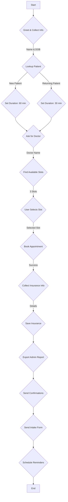

# AI Medical Appointment Scheduling Agent

This project is a demonstration of an AI agent that automates medical appointment scheduling, built using **LangGraph** and **LangChain**. It simulates a real-world healthcare technology solution designed to reduce no-shows and streamline clinic operations.

## Features

- **Conversational Booking**: A user can book an appointment through a chat interface.
- **Patient Lookup**: Differentiates between new (60-min slot) and returning (30-min slot) patients.
- **Smart Scheduling**: Finds and displays available slots from doctors' schedules.
- **Atomic Booking**: Ensures that slots are booked safely, preventing double-booking.
- **Insurance & Reporting**: Collects insurance details and generates an admin report for each booking.
- **Automated Notifications**: Sends confirmation emails/SMS and patient intake forms.
- **Reminder System**: Schedules automated reminders to reduce no-shows.

---

## 🚀 How to Run

### Prerequisites
- Python 3.9+
- `bash` (for the run script)

### Setup Instructions

1.  **Clone the repository and set up the environment:**
    ```bash
    git clone <your-repo-url>
    cd <your-repo-folder>
    python -m venv venv
    source venv/bin/activate  # On Windows, use `venv\Scripts\activate`
    ```

2.  **Create a `.env` file** in the root directory and add your Groq API key:
    ```env
    # Get your key from [https://console.groq.com/keys](https://console.groq.com/keys)
    GROQ_API_KEY="your-groq-api-key-here"

    # --- Optional: For Real Email ---
    # SMTP Settings for Email
    # SMTP_SERVER="smtp.gmail.com"
    # SMTP_PORT="587"
    # SMTP_USERNAME="your-email@gmail.com"
    # SMTP_PASSWORD="your-app-password" # Use an app password for Gmail
    # EMAIL_FROM="your-email@gmail.com" # Sender email address
    ```

3.  **Make the run script executable and launch the demo:**
    ```bash
    chmod +x run_demo.sh
    ./run_demo.sh
    ```
    This script will:
    - Install all required Python packages.
    - Generate synthetic `data/patients.csv` and `data/schedules.xlsx`.
    - Start the Streamlit web server.

4.  **Place the Intake Form:**
    The application is hardcoded to look for the patient intake form at `/mnt/data/New Patient Intake Form (1).pdf`. Please ensure a file exists at this exact path on your system. If you cannot use this path, you can modify it in `src/tools.py` inside the `send_intake_form` function.

---

## 🛠️ Technical Overview

### Architecture
The application uses a **ReAct (Reasoning and Acting)** agent architecture built with LangGraph.

-   **Frontend**: Streamlit provides a simple and effective chat interface.
-   **Backend/Agent**: LangGraph orchestrates the flow of conversation and tool usage.
-   **LLM**: The agent is powered by an LLM via `ChatGroq` (defaulting to `llama-3.1-8b-instant`), which can be configured.
-   **Tools**: A set of Python functions that provide the agent with capabilities to interact with the "real world" (in this case, our mock data files and notification services).
-   **Data**: Mock patient and schedule data are stored in CSV and Excel files to simulate an Electronic Medical Record (EMR) system and clinic calendars.

### Swapping the LLM
You can easily swap the language model by modifying `src/agent_setup.py`. For example, to use a model from OpenAI:

```python
# In src/agent_setup.py
# from langchain_openai import ChatOpenAI
# model = ChatOpenAI(model="gpt-4o-mini", temperature=0)
```
Remember to set the corresponding API key (e.g., `OPENAI_API_KEY`) in your `.env` file.

---

### How It Works: The Agent's Workflow

The agent is guided by a system prompt to follow a strict, step-by-step process.



1.  **Greeting**: The agent starts by greeting the user and asking for their full name and date of birth to begin the process.
2.  **Patient Lookup**: It uses the `lookup_patient` tool to check if the user is a new or returning patient. This determines the appointment duration (60 vs. 30 minutes).
3.  **Find Slots**: After confirming the doctor preference, it calls `find_available_slots` to find the next three open slots that match the required duration.
4.  **Book Appointment**: Once the user selects a slot, the `book_appointment` tool is called. It uses a file lock to atomically update the Excel schedule, preventing double-bookings.
5.  **Collect & Save Insurance**: The agent then prompts for insurance details, which are saved using the `save_insurance_details` tool.
6.  **Confirm & Notify**: Finally, it orchestrates a series of concluding tasks:
    -   `export_admin_report`: Logs the booking details to an admin-facing report.
    -   `send_email` & `send_sms`: Sends confirmation messages (logged to the console by default).
    -   `send_intake_form`: Sends the new patient form.
    -   `schedule_reminder_jobs`: Sets up three automated reminders using APScheduler.

---

## ⚖️ Security & PHI Disclaimer

**This is a demonstration project and is NOT secure for handling real Protected Health Information (PHI).**

-   **Data Storage**: Patient data is stored in plain-text CSV and Excel files, which is not compliant with HIPAA or other privacy regulations.
-   **Authentication**: The application has no user authentication or authorization.
-   **Security**: Do not deploy this application in a production environment or use real patient data. For a real-world application, you would need to use a secure database, implement role-based access control, encrypt data at rest and in transit, and undergo security audits.
